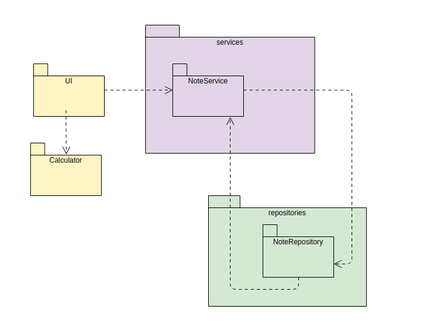
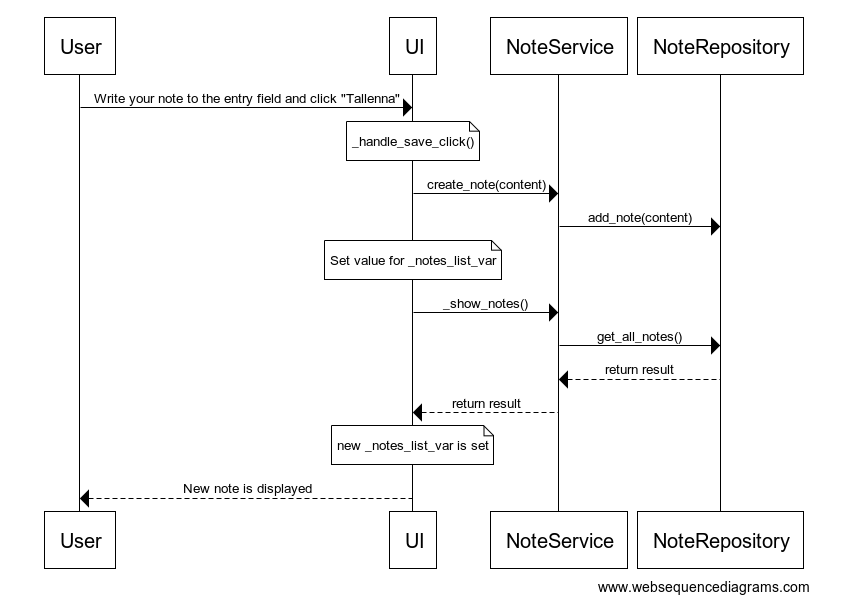

## Arkkitehtuurikuvaus

Luokka UI sisältää käyttöliittymästä vastaavan koodin, ja luokka Calculator laskintoiminnallisuuden sovelluslogiikasta vastaavan koodin. UI:lla on riippuvuus luokkaan Calculator.

Muistiinpanojen käsittelystä vastaavat luokat NoteService ja NoteRepository. NoteService tarjoaa käyttöliittymälle muistiinpanojen tallentamiseen ja esittämiseen metodit. Tietojen tallennuksesta ja hakemisesta tietokannassa vastaa NoteRepository, joka tarjoaa NoteServicelle metodit.

### Muistiinpanon lisääminen

Aloitusnäkymässä käyttäjä syöttää muistiinpanon sille varattuun kenttään ja painaa "Tallenna".

Painikkeen painamiseen reagoi tapahtumankäsittelijä, joka kutsuu sovelluslogiikan NoteService metodia create_note jolla on parametrina syötekenttään syötetty sisältö. NoteService välittää tallennuspyynnön NoteRepositoryyn, jossa uusi muistiinpano lisätään tietokantaan. Tämän jälkeen UI:ssa olevalle muuttujalle, joka näyttää muistiinpanot listassa, asetetaan uusi arvo. Tämä tapahtuu kutsumalla NoteServicen metodia _show_notes(). NoteService puolestaan kutsuu NoteRepositoryn metodia get_all_notes, joka palauttaa kaikki tietokantaan haetut vinkit. Kun tämä UI:ssa olevan muuttujan arvo päivittyy renderöityy se ruudulle, ja käyttäjä näkee tallennetun muistiinpanon näytöllä heti.