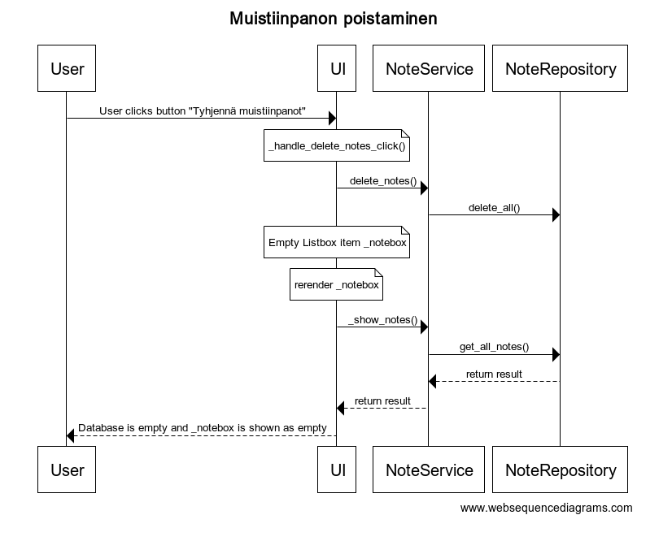
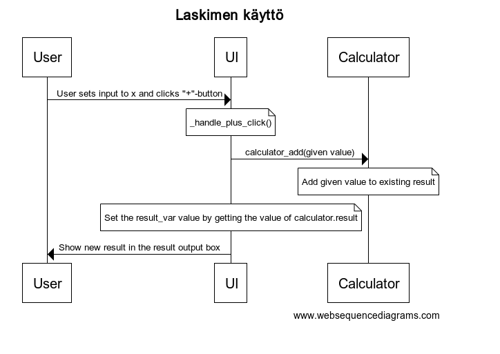

## Arkkitehtuurikuvaus

### Rakenne

Ohjelmassa on sovellettu kerrosarkkitehtuuria, jossa ohjelma on jaettu kolmeen tasoon: UI, services ja calculator, sekä repositories. Kokonaisuuksien välisiä suhteita on havainnoillistettu pakkauskaaviolla:

Luokka UI sisältää käyttöliittymästä vastaavan koodin, ja luokka Calculator laskintoiminnallisuuden sovelluslogiikasta vastaavan koodin. UI:lla on riippuvuus luokkaan Calculator.

Muistiinpanojen käsittelystä vastaavat luokat NoteService ja NoteRepository. NoteService tarjoaa sovelluslogiikan käyttöliittymälle muistiinpanojen tallentamiseen ja esittämiseen metodit. Tietojen tallennuksesta ja hakemisesta tietokannassa vastaa NoteRepository, joka tarjoaa NoteServicelle metodit.

### Käyttöliittymä

Käyttöliittymässä on vain yksi näkymä. Näkymästä vastaa luokka UI. 

### Sovelluslogiikka

Sovellus sisältää toiminnallisuuksia niin laskimen kun muistiinpanojen osalta, ja näistä toiminnallisuuksista vastaavat erilliset luokat, Calculator ja NoteService. Luokat tarjoavat kaikille käyttöliittymän toiminnoilla metodit.

### Tietojen pysyväistallennus

Pakkauksessa repositories oleva luokka NoteRepository vastaa muistiinpanojen pysyväistallennuksesta. Muistiinpanot tallennetaan SQLite tietokantaan. Repository- suunnittelumallin myötä NoteService luokan testauksessa on voitu käyttää stub-tyyppistä ratkaisua oikean tietokannan sijasta.

Tietokannassa on käytetty yhtä tietokantataulua Notes, jolla on kaksi kenttää: kokonaislukuarvoinen kenttä *id*, ja tekstityyppinen kenttä *content*.

### Keskeiset toiminnallisuudet

Seuraavaksi sekvenssikaavioina päätoiminnallisuudet muistiinpanojen käsittelyn osalta.

#### Muistiinpanon lisääminen

Aloitusnäkymässä käyttäjä syöttää muistiinpanon sille varattuun kenttään ja painaa "Tallenna".

Painikkeen painamiseen reagoi tapahtumankäsittelijä, joka kutsuu sovelluslogiikan NoteService metodia create_note jolla on parametrina syötekenttään syötetty sisältö. NoteService välittää tallennuspyynnön NoteRepositoryyn, jossa uusi muistiinpano lisätään tietokantaan. Tämän jälkeen UI:ssa olevalle muuttujalle, joka näyttää muistiinpanot listassa, asetetaan uusi arvo. Tämä tapahtuu kutsumalla NoteServicen metodia _show_notes(). NoteService puolestaan kutsuu NoteRepositoryn metodia get_all_notes, joka palauttaa kaikki tietokantaan haetut vinkit. Kun tämä UI:ssa olevan muuttujan arvo päivittyy renderöityy se ruudulle, ja käyttäjä näkee tallennetun muistiinpanon näytöllä heti.

#### Muistiinpanojen poistaminen

Aloitusnäkymässä näkyvät käyttäjän syöttämät, poistamattomat muistiinpanot oikealla ruudukossa. Ruudukon alla on painike "Tyhjennä muistiinpanot".

Painikkeen painamiseen reagoi tapahtumankäsittelijä, joka kutsuu sovelluslogiikan NoteService metodia delete_notes. NoteService välittää poistopyynnön NoteRepositoryyn, jossa tietokantataulu Notes tyhjennetään muistiinpanoista. Tapahtumankäsittelijä myös  tyhjentää Listbox-tyyppisen muuttujan _notebox sisällön, jolloin näkymä renderöityy käyttäjälle, ja muistiinpanot sisältävä ruudukko näkyy tyhjänä.

#### Laskimen toiminnallisuus

Seuraava sekvenssikaavio kuvaa tilannetta, jossa käyttäjä syöttää "Syöte:"-kenttään luvun ja painaa tämän jälkeen "+"-näppäintä.

Painikkeen painamiseen reagoi tapahtumankäsittelijä, joka kutsuu luokan Calculator metodia add. Metodille välitetään parametrina käyttäjän "Syöte:"-kenttään syöttämä luku. Metodi add suorittaa laskutoimituksen muuttujan result suhteen. Tapahtumankäsittelijä myös asettaa arvon muuttujalle result_var hakemalla uudeksi arvoksi result:in arvon. Tämä renderöi näkymän, ja käyttäjälle näkyy uusi tulos.
