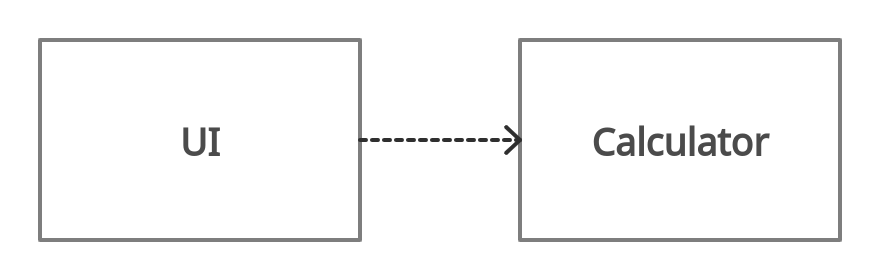

## Arkkitehtuurikuvaus

Ohjelman perusrakenne on toistaiseksi hyvin yksinkertainen.

Luokka UI sisältää käyttöliittymästä vastaavan koodin, ja luokka Calculator sovelluslogiikasta vastaavan koodin. UI:lla on riippuvuus luokkaan Calculator.