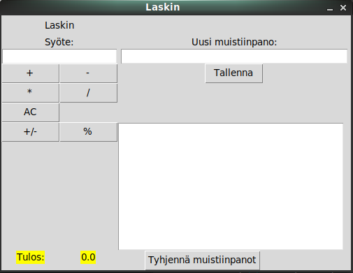

# Käyttöohje

Projektin viimeisimmän releasin voi ladata [täältä](https://github.com/suomalainenmari/ot-harjoitustyo2021/releases). Lähdekoodi löytyy Assets-osion alta Source code nimisenä zip-pakettina.

## Ohjelman käynnistäminen

Ennen ohjelman käynnistämistä, asenna riippuvuudet komennolla:
```
poetry install
```

Tämän jälkeen ohjelman alustustoimet tulee suorittaa komennolla:
```
poetry run invoke build
```

Ohjelman voi nyt käynnistää komennolla:
```
poetry run invoke start
```

## Aloitusnäkymä

Sovellus käynnistyy näkymässä, jossa vasemmalla puolella löytyy perinteinen laskin, ja oikealla puolella muistiinpanot.



Laskutoimituksien tekeminen onnistuu syöttämälle Syöte:-kenttään haluttu luku ja valitsemalla painikkeista mitä luvulla halutaan laskea. Tulos näkyy alareunassa. Laskutoimitukset tehdään suhteessa tulokseen.

Oikealla puolella olevaan Muistiinpanot:-kenttään voi kirjoittaa haluamansa muistiinpanon, jonka voi tallentaa Tallenna-painikkeella. Tämän jälkeen muistiinpano tulee näkyviin Tallenna-painikkeen alapuolelle.

## Laskin

Eri painikkeet suorittavat eri laskuoperaatioita:
  * "+"-painike laskee syötetyn luvun yhteen alhaalla näkyvän tuloksen kanssa
  * "-"- painike vähentää syötetyn luvun alhaalla näkyvästä tuloksesta
  * "*"-painike kertoo syötetyn luvun alhaalla näkyvän tuloksen kanssa
  * "/"-painike jakaa alhaalla näkyvän tuloksen syötetyllä luvulla
  * "AC"-painike nollaa laskimen, eli asettaa tuloksen arvoksi 0.
  * "+/-"-painike muuttaa alhaalla näkyvän tuloksen sen vastaluvuksi
  * "%"-painike muuttaa alhaalla näkyvän tuloksen prosenteiksi


