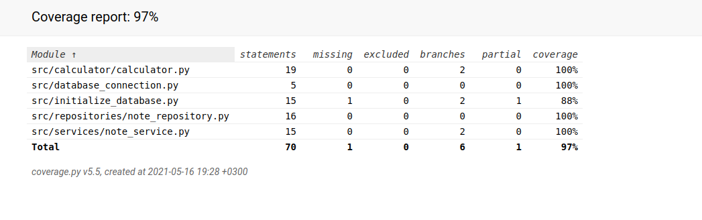

# Testausdokumentti

Ohjelmaa on testattu automatisoidusti yksikkö- ja integraatiotasolla käyttäen unittestiä. Tämän lisäksi testausta on tehty järjestelmätasolla manuaalisesti.

## Yksikkö- ja integraatiotestaus

### Testauskattavuus

Käyttöliittymäkerrosta ei testata automatisoiduilla testeillä. Muiden ohjelmakerrosten osalta haaraumakattavuus on 97%.

Haaraumakattavuutta laskee tiedosto initialize_database.py. Tiedostosta ei ole testattu tiedoston suoritusta komentoriviĺtä. 

### Järjestelmätestaus

Järjestelmätason testausta on suoritettu manuaalisesti, niin asennuksen ja konfiguroinnin puolesta, sekä toiminnallisuuksien puolesta. Sovellus on ladattu ja testattu noudattaen [käyttöohjeita](./kayttoohje.md).

[Vaatimusmäärittelydokumentissa](./vaatimusmaarittely.md) mainitut toiminnallisuudet on testattu käyttöliittymän kautta. Myös virheellisiä arvoja, kuten tyhjiä kenttiä, sekä kirjaimia laskimeen on koitettu syöttää. Ohjelma ei printtaa Exceptioneita eikä ohjelma kaadu.

## Sovellukseen jääneet laatuongelmat

Sovellus ei varaudu virhetilanteeseen, jossa sovellusta koitetaan käynnistää ilman että tietokantaa on alustettu `poetry run invoke build`-komennolla.

